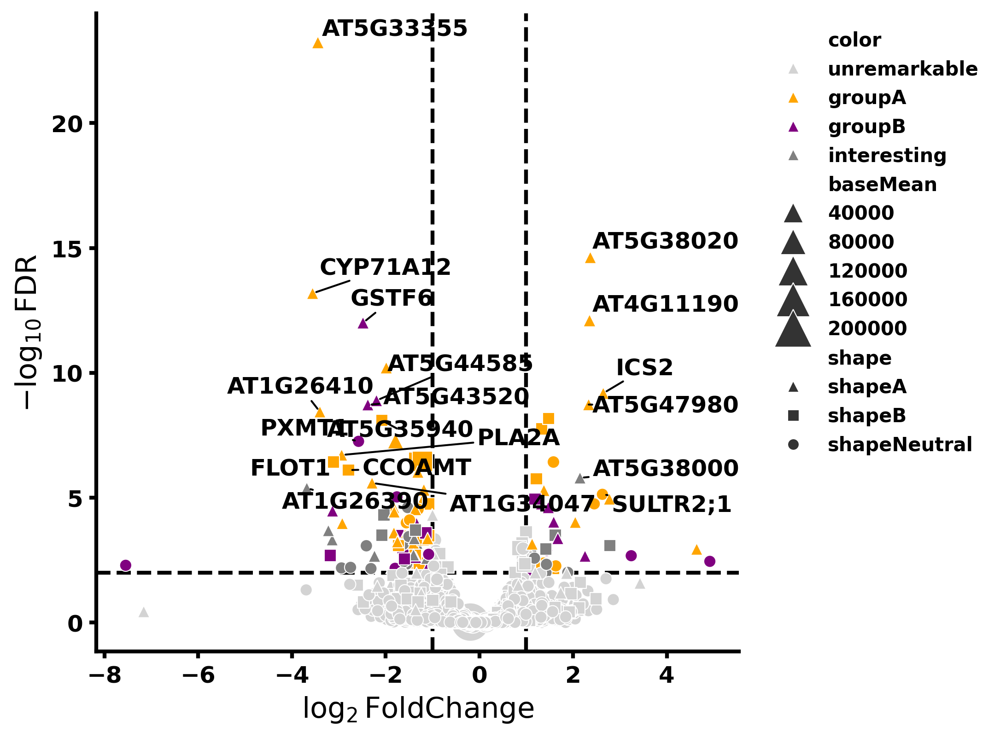

# RNA-Seq Analysis using PyDESeq2, Scanpy, and GSEAPY 🚀

**Sample volcano plot illustrating significantly up- and down-regulated genes. Inspired from Sanbomics tutorials**

Welcome to this exciting repository! In here, we tackle **RNA-Seq differential expression** using some top-notch Python libraries, including [PyDESeq2](https://pydeseq2.readthedocs.io/), [Scanpy](https://scanpy.readthedocs.io/), and [gseapy](http://gseapy.readthedocs.io/). The goal is to go from raw counts to eye-catching plots and meaningful biological insights. We have used an RNAseq data from one of my published articles [Dash et.al 2023](https://doi.org/10.1093/plphys/kiad465),  Read on for a whirlwind tour of how the pipeline works!

---

## Feature Highlights 🔎

1. **Metadata loading**  
   - We first load up your experimental design (e.g., which samples are control vs. mutant).  
   - This helps with more accurate grouping later on.

2. **Count table parsing**  
   - Put your gene expression data in a nice tidy `pandas` DataFrame.  
   - Basic sanity checks happen to remove zero-count genes, so we don’t clutter results with irrelevant entries.

3. **Filter for analysis**  
   - Only keep the samples indicated in your metadata file.  
   - Reorder sample conditions to fit the design formula required by our DESeq2-based analysis.

4. **DESeq2: The heart of it all**  
   - We create a `DeseqDataSet` using PyDESeq2 and run `dds.deseq2()`.  
   - Enjoy automatic normalization and robust statistical modeling of differential gene expression.

5. **Inspecting DE results**  
   - A `DeseqStats` object gives you user-friendly DE outputs.  
   - Merge with annotation data (e.g., gene symbols or descriptions) to learn more about those up/down-regulated genes.

6. **Exploratory goodies**  
   - Optionally convert normalized counts into an `AnnData` object (for Scanpy).  
   - Generate PCA plots and heatmaps of sample-sample correlations to visualize how your samples cluster.  
   - An MA plot shows whether your mutants are collectively pushing certain genes up or down.

7. **Volcano plot 🏔**  
   - Quickly visualize significant genes: –log10(FDR) on the Y-axis and log2FoldChange on the X-axis.  
   - Zoom in on the truly 'volcanic' genes that might be your next scientific breakthrough!

8. **Heatmaps of DE genes**  
   - Heatmap #1: All significantly DE genes together.  
   - Heatmap #2: Top 20 most up and top 20 most down.  
   - Perfect for showing that stellar cluster of similarly regulated genes.

---

## Setup & Installation ⚙️

Make sure you have **Python ≥ 3.7** and the following libraries:

- [pandas](https://pandas.pydata.org/)  
- [numpy](https://numpy.org/)  
- [seaborn](https://seaborn.pydata.org/)  
- [matplotlib](https://matplotlib.org/)  
- [scanpy](https://scanpy.readthedocs.io/)  
- [anndata](https://anndata.readthedocs.io/)  
- [gseapy](https://gseapy.readthedocs.io/)  
- [PyDESeq2](https://pydeseq2.readthedocs.io/)

Install them using pip:

    pip install pandas numpy seaborn matplotlib scanpy anndata gseapy pydeseq2

---

## How to Use this Code 📖

1. **Prepare Inputs**  
   - **Metadata**: Lists sample IDs and whether they’re control or mutant.  
   - **Read counts**: A CSV with gene IDs and read counts per sample.  
   - **Annotation file (optional)**: For mapping gene IDs to symbols or other fun gene descriptors.

2. **Run the Script**  
   - Place your data files (`read_counts_table.csv`, etc.) alongside `rna_seq_analysis.py`.  
   - Adjust metadata entries if needed.  
   - Then do:

        python rna_seq_analysis.py

3. **Outputs Galore**  
   - **DE results** are printed and saved in a convenient DataFrame (`res`).  
   - **Volcano Plot**: automatically saved as `volcano.png`.  
   - **Heatmaps**: watch for `heatmap_all_sig_genes.png` and `heatmap_top20_up_down.png`.  
   - Other helpful plots like PCA or correlation heatmaps are displayed or saved (depending on settings) for your viewing pleasure.

---

## Tweaks & Tips 🎨

- **Filtering Criteria**: Currently `padj < 0.1` and `|log2FoldChange| > 0.5`. Feel free to change these to taste.  
- **Normalization**: Handled internally by PyDESeq2. Check its docs if you need fancy transformations or advanced steps.  
- **Plot styling**: Colors, sizes, markers—be creative if you want your figures to pop in publications!  
- **GSEA**: You can explore enrichment analysis with [gseapy](http://gseapy.readthedocs.io/). Make sure your gene IDs match your favorite gene set database.

---

## Further Explorations & Next Steps 🌱

Here are some additional ideas you could try with the script and data files generated:

1. **Additional DE Thresholding and Filters**  
   - Adjust significance thresholds (p-adj, log2FoldChange) and examine how the DE gene set changes.  
   - Filter out low-expression genes or apply other custom criteria to refine your results.

2. **Gene Ontology (GO) and Pathway Analysis**  
   - Use [gseapy](https://gseapy.readthedocs.io/) or [GOATOOLS](https://github.com/tanghaibao/goatools) to discover enriched biological processes and pathways for your DE gene list.  
   - This step can help you interpret the functional implications of your results.

3. **Downstream Network Inference**  
   - Construct gene co-expression or gene regulatory networks from significantly DE genes.  
   - Visualize these networks using libraries like [NetworkX](https://networkx.org/) or Cytoscape.

4. **Time-Course or Multi-Condition Extensions**  
   - If your dataset spans multiple time points or involves more than two conditions, consider more complex models (e.g., multi-factor design).  
   - Compare results across time or across a combination of conditions.

5. **Single-Cell RNA-Seq Adaptation**  
   - If you have single-cell data, add extra QC steps for cell filtering and use specialized methods to handle single-cell complexities.  
   - Explore DR (dimensionality reduction) methods like UMAP or t-SNE in [Scanpy](https://scanpy.readthedocs.io/).

6. **Custom Normalization or Batch Correction**  
   - If batch effects are suspected, adopt methods like Combat (`scanpy.pp.combat`) or other batch correction techniques.  
   - Compare different normalization strategies (TPM, FPKM) to see which best suits your analysis.

7. **Custom Visualization**  
   - Plot violin plots, advanced cluster heatmaps with gene-level or sample-level annotations, or bubble charts to emphasize key gene sets.  
   - Highlight known biomarkers or add more annotation layers to your volcano plots for extra insight.

8. **Workflow Automation**  
   - Convert this script into a [Snakemake](https://snakemake.readthedocs.io/) or [Nextflow](https://www.nextflow.io/) pipeline for automated, reproducible analysis.  
   - This helps if you plan to expand the workflow or re-run it on multiple datasets frequently.

---

## Troubleshooting 🛠

- **Can’t find `dds.layers["normed_counts"]`**: PyDESeq2 versions can differ. Check their docs or search the relevant layer name if it has changed.  
- **Check library versions** if you see strange errors. Sometimes a quick upgrade or downgrade fixes compatibility.

---

## License & Crediting 🏛

Feel free to use or modify for academic and non-commercial purposes, but choose (and mention) the open-source license that fits your project. Remember to credit this pipeline in your publications or presentations whenever you publish exciting results!

---

## Contributing 🤝

Got a neat idea or found a bug? Awesome!  
- Fork the repo, make your changes, and send a pull request.  
- Or file an issue directly, and we’ll see how to turn your feedback into reality.

Happy analyzing and may the best genes win! 🎉
